# Rubber Ducky DYI

La idea de utilizar una placa de arduino uno para convertirla en una Rubber Ducky no es única, ya hemos leído sobre diversos scripts para crearse un [Duckduino](https://github.com/Dukweeno/Duckuino), además los diversos usos que le podemos dar para ejercicios de red team como el proyecto [Ardcuky](https://www.elladodelmal.com/2017/07/arducky-un-rubber-ducky-hecho-sobre.html). 

Por otra parte, aquellos que desconozcan lo que es un **Rubber Ducky:** es un teclado malicioso envuelto en la forma de un pendrive, de manera que no levanta sospecha y que es capaz de ejecutar comandos de teclado a gran velocidad.

Este artículo tiene como objetivo enseñar los pasos necesarios para crear nuestro Rubber Ducky utilizando una placa arduino uno o similares.

##### Requerimientos

1. [Arduino Uno](https://www.amazon.com/dp/B01D8KOZF4/ref=redir_mobile_desktop?_encoding=UTF8&aaxitk=5CHijdLRQWZsrKhVx2xSDg&hsa_cr_id=1247439260401&pd_rd_plhdr=t&pd_rd_r=42d4ee48-3776-437d-9d43-98161614bafb&pd_rd_w=4GTEE&pd_rd_wg=8lKLq&ref_=sbx_be_s_sparkle_mcd_asin_0_title)
2. 3X Female to Female Cable
3. Male to Female Cable
4. Cable USB
5. IDE Arduino

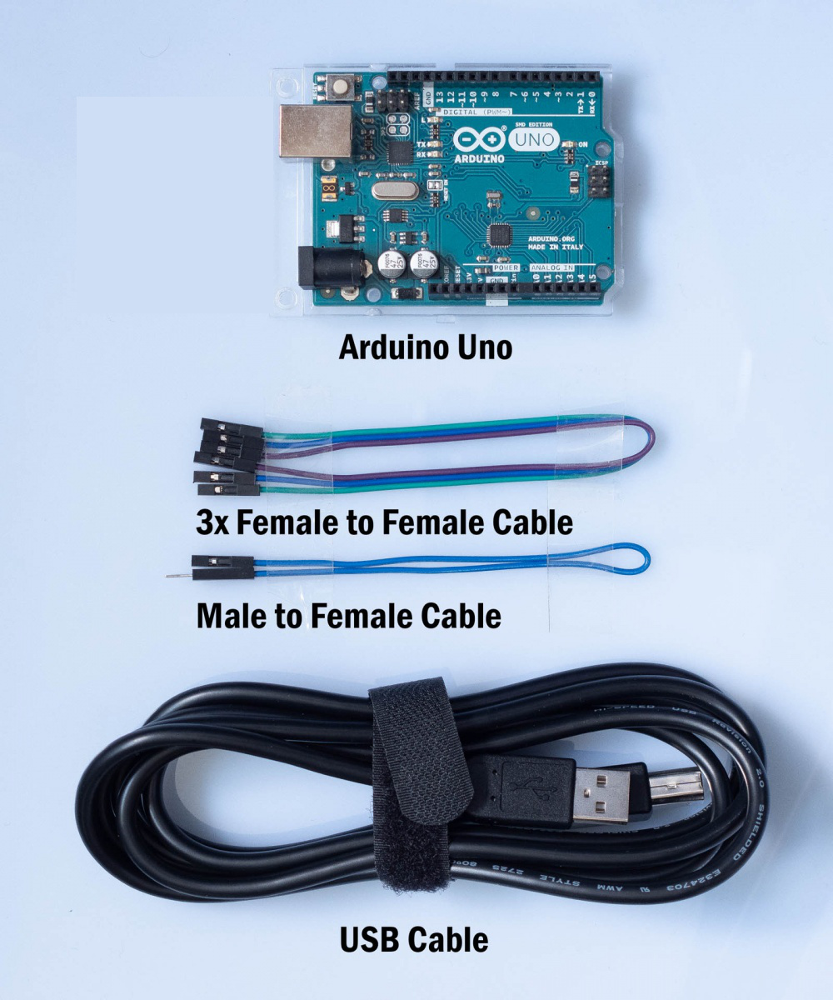

Fuente: https://wiki.elvis.science/index.php?title=Arduino_Install_Hoodloader2

**Nota:** La placa arduino uno tiene dos microcontroladores de los cuales el que nos interesa es ATmega16u2

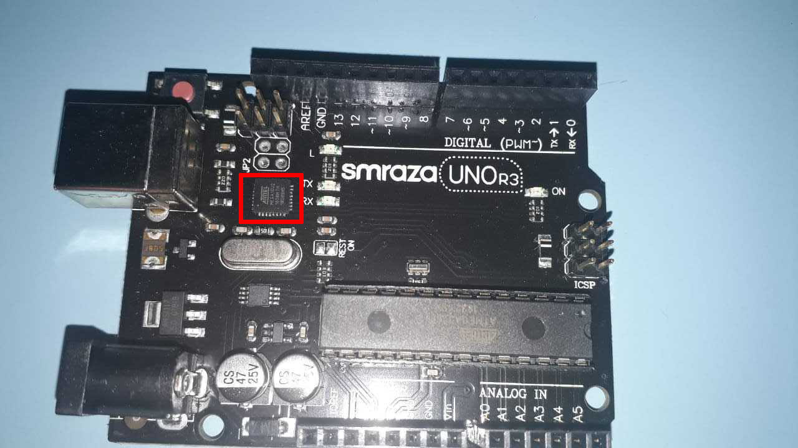

Este microcontrolador se puede flashear para que funcione como un dispositivo USB AVR, emulando el dispositivo HID para que trabaje como un Rubber Ducky

##### 1. Instalación del bootloader

Procedemos a clonar el repositorio 

```shell
git clone https://github.com/NicoHood/HoodLoader2.git
```

Accedemos al repositorio a la siguiente ruta

```shell
cd HoodLoader2/avr/examples/Installation_Sketch
```

Vamos al IDE y cargamos (subir) el Sketch de instalación (**Installation_Sketch.ino**)

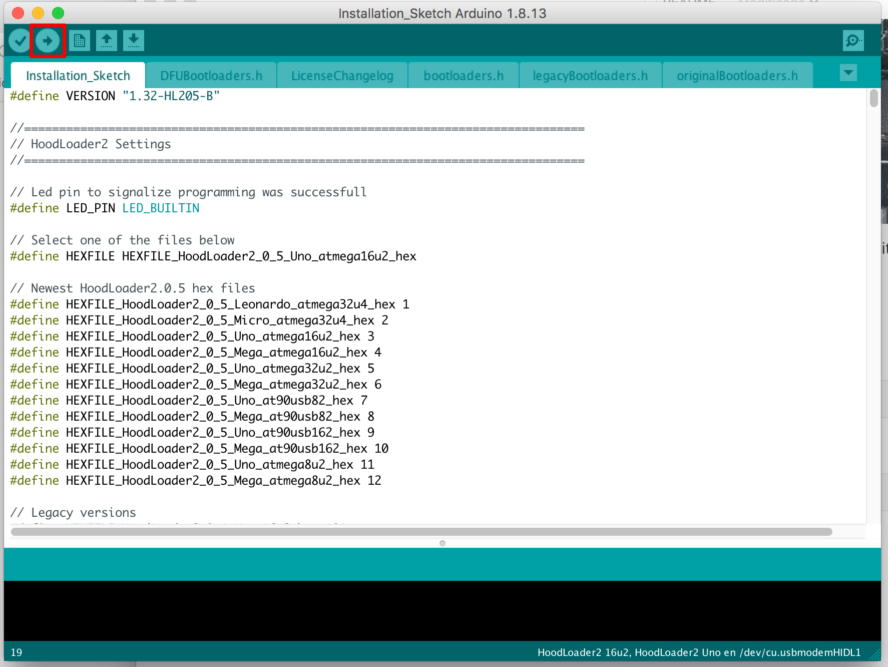

Observamos varias advertencias al final nos debe indicar que se subió correctamente y el tamaño del archivo

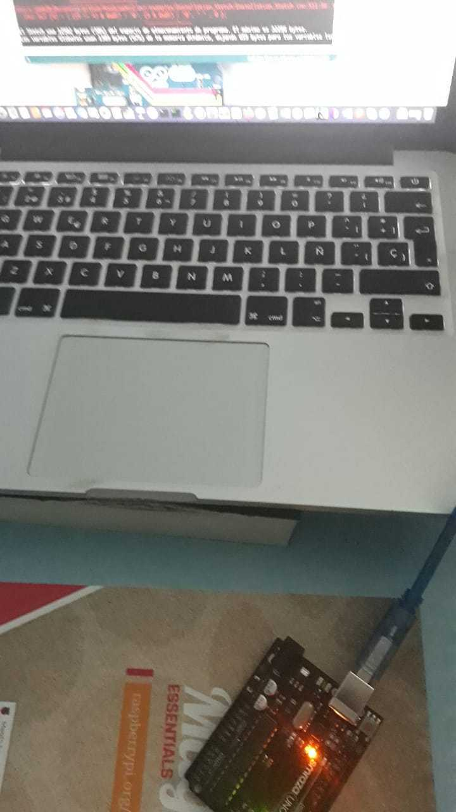


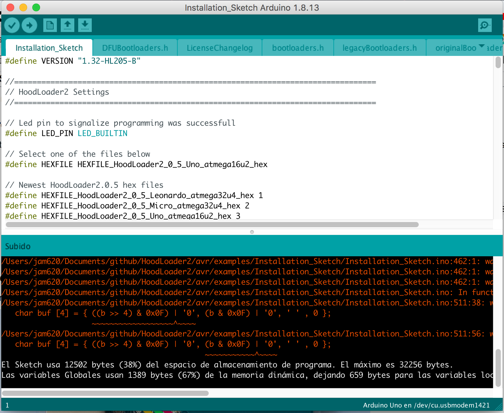

**2. Esquema de cableado**

Procedemos a conectar todos los componentes en el esquemático mientras el arduino este desconectado, a continuación observamos el esquema.

 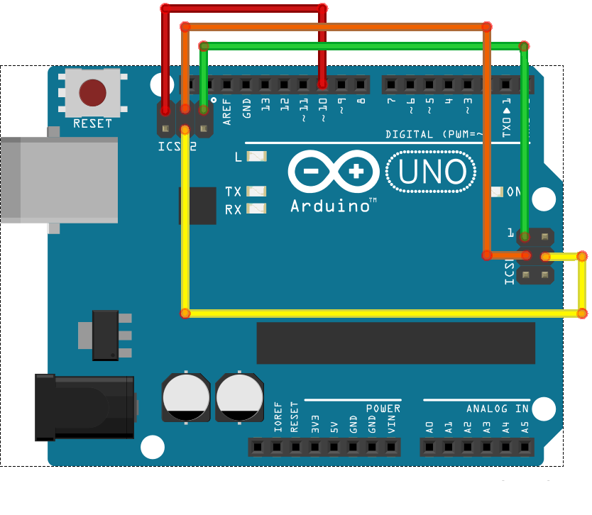

**Fuente:** https://kr0no.me/post/2016/10/usb-rubber-ducky-arduino

Debe quedarnos de la siguiente manera

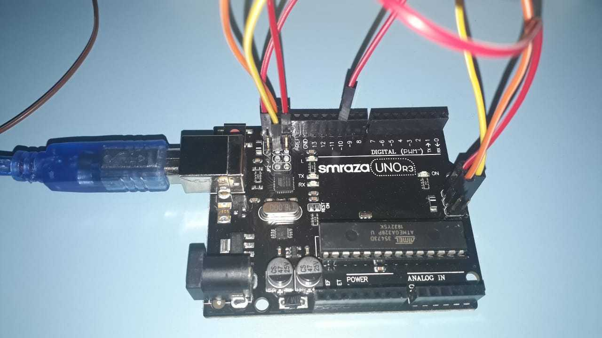

Una vez tengamos el cableado listo, vamos a conectar el arduino a nuestro equipo y comenzará el flaqueado del nuevo bootloader. Al conectarlo el led parpadea 10 segundos lentos, luego debemos esperar 30 segundos y nos daremos cuenta que ha finalizado cuando el led parpadee rápidamente cada 100ms.

**Nota:** Si el led sigue parpadeando lentamente (cada segundo), la instalación fallo, y volverá a intentar autoflashearse en 10 segundos. Este Hoodloader sobreescribe el Bootloder y puede causar un brick durante el proceso. No nos hacemos responsables de lo que pueda sucederle al arduino.

##### **3. Instalación de las definiciones de las tarjetas**

Iremos a preferencias en el IDE de Arduino, luego procedemos añadir la url al Gestor de Tarjetas

```markdown
https://raw.githubusercontent.com/NicoHood/HoodLoader2/master/package_NicoHood_HoodLoader2_index.json
```

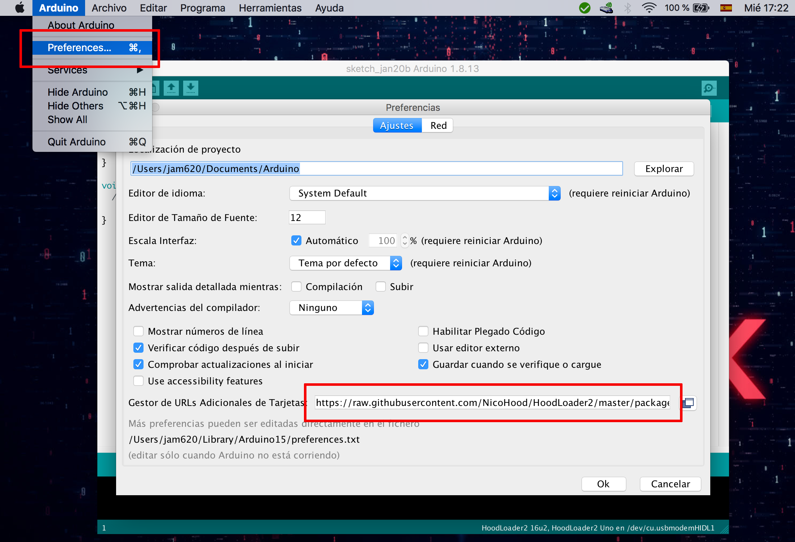

Procedemos a ir al Gestor de Tarjetas en el menu **Herramientas-->Board-->Board Manager**

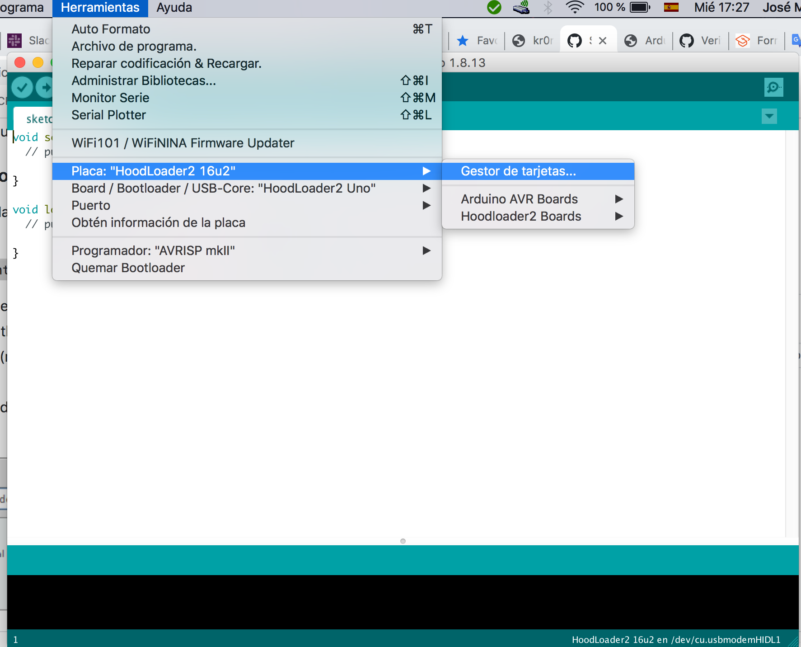

**Nota:** En mi caso ya tenia instalado la placa por eso se observan las opciones

Nos aparece la opción para instalar 

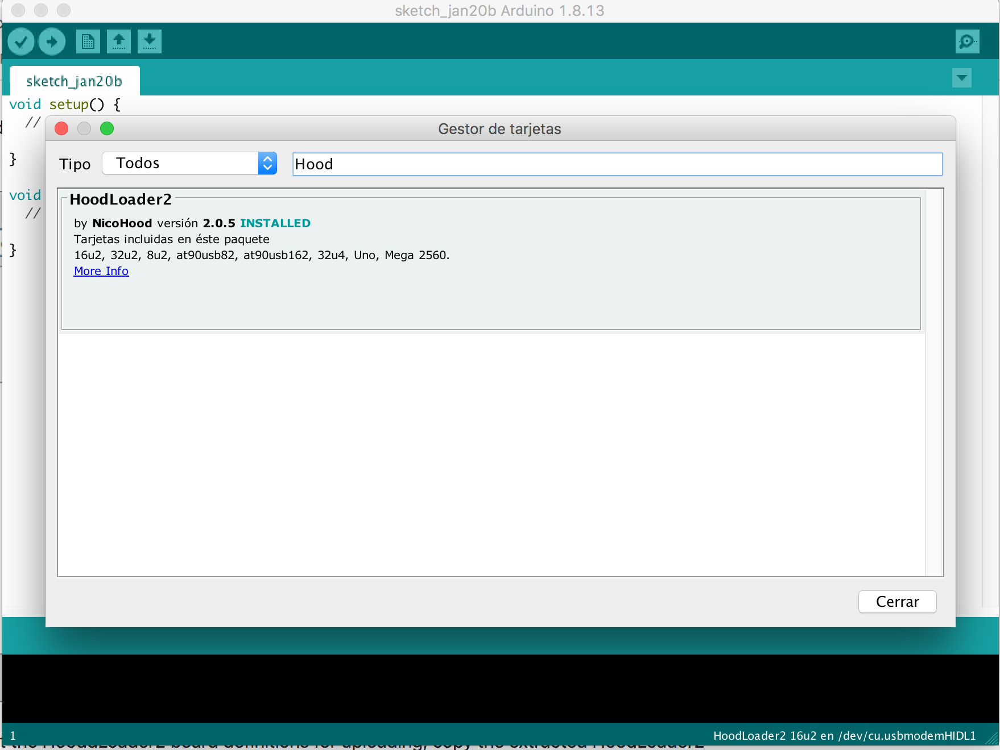

Seleccionamos **HoodLoader2 16U2**

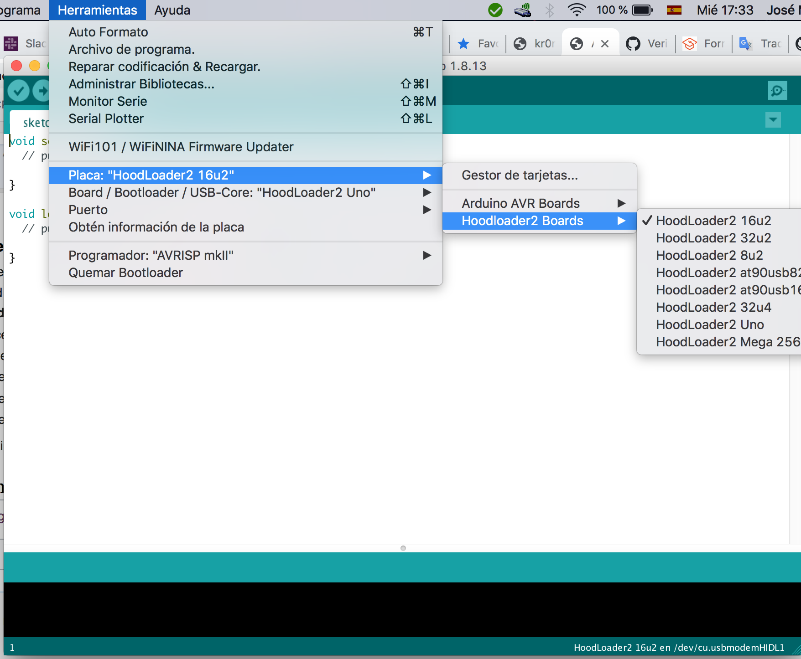

Ahora seleccionamos HoodLoader2 Uno 16u2 en **Herramientas --> Board --> Bootloader**

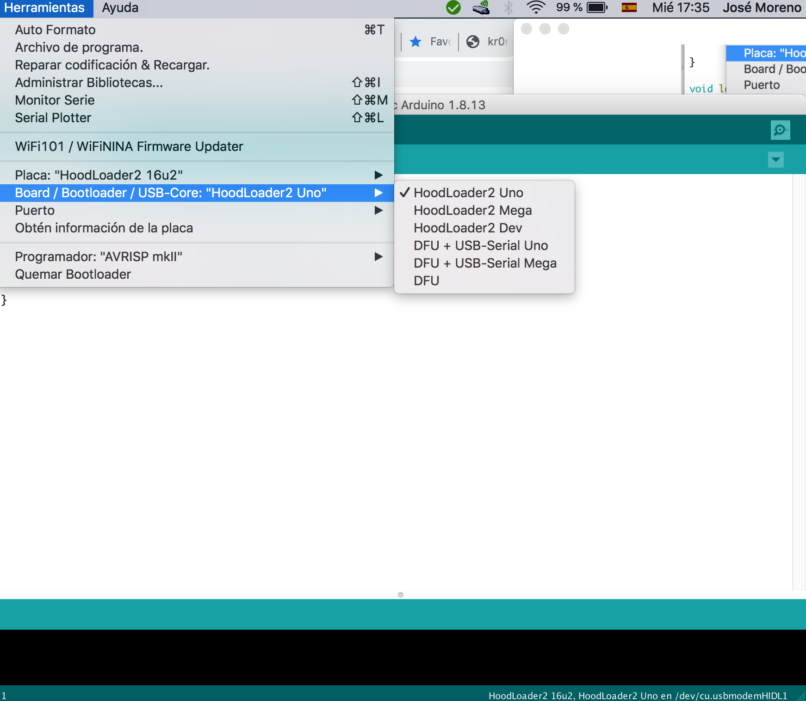

Por último debemos seleccionar el puerto correcto probamos subiendo un sketch, debemos desear e instalar la librería [HID-Project](https://github.com/NicoHood/HID)

```
#include "HID-Project.h"

void setup() {
    Keyboard.begin();
    delay(500);

    Keyboard.press(KEY_LEFT_GUI);
    Keyboard.press(KEY_R);
    Keyboard.releaseAll();
    delay(500);
    Keyboard.println("cmd.exe");
    delay(500);
    Keyboard.println("calc.exe");
}

void loop() {}
```

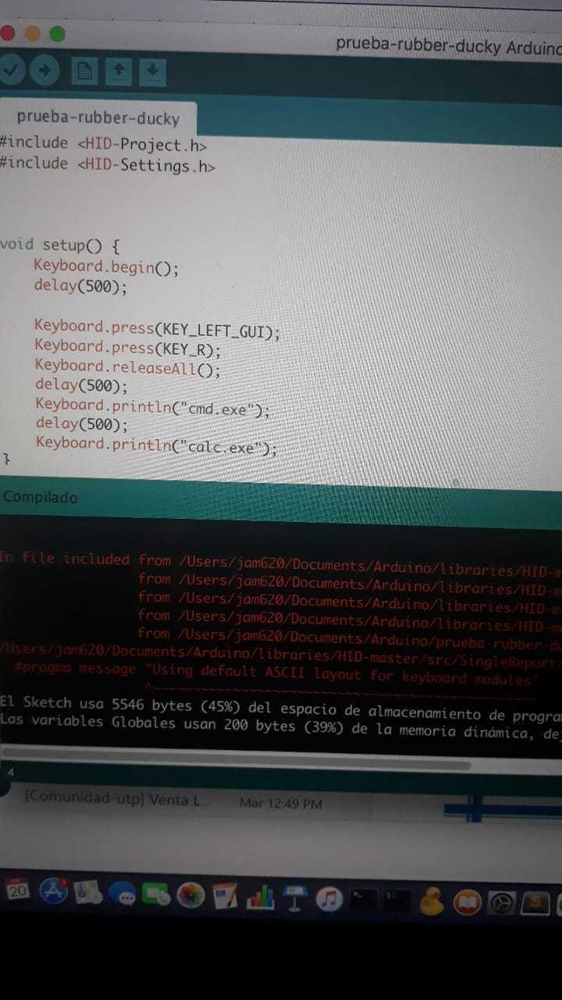


Finalmente la prueba la realice en una máquina virtual en donde observamos la cmd iniciándose

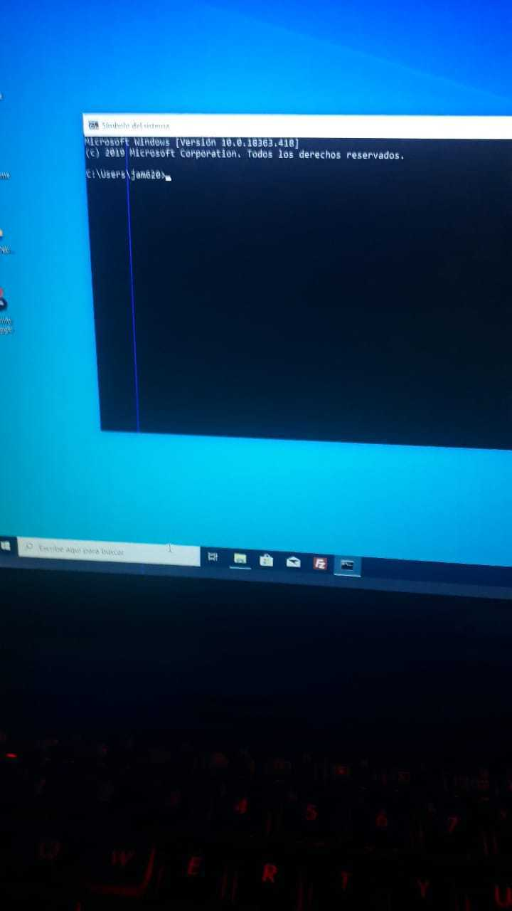

Al utilizar una máquina virtual no me funciono al 100% pero les dejo una captura del duckduino escribiendo en Kali, donde se conecta quiere escribir.

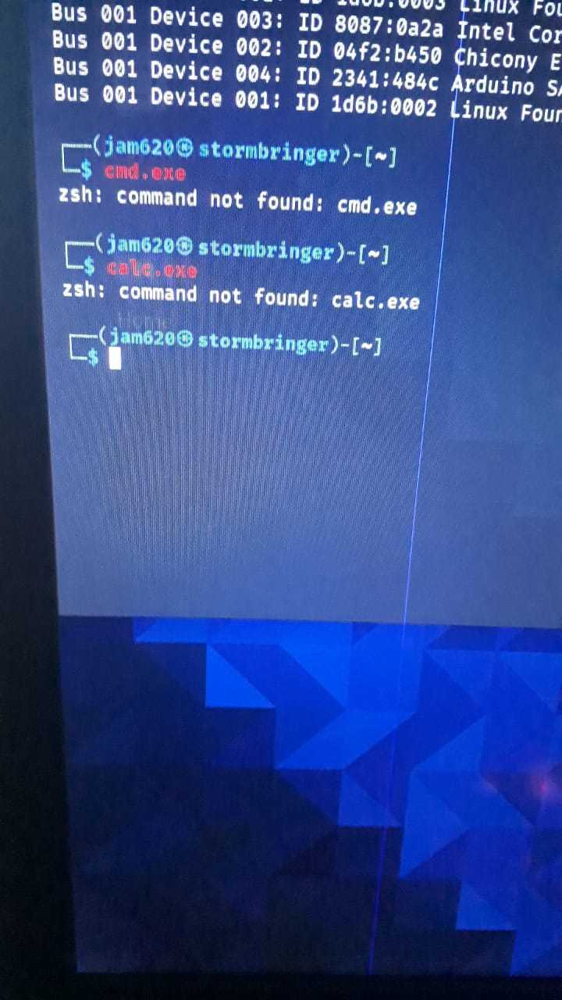


Podemos concluir que hemos convertido nuestro arduino a un Rubber Ducky, que podemos añadirles Ducky scripts que van desde abrir una calculadora o escribir en la cmd, hasta invocar power shell y establecer una shell reversa.

##### Referencias

* *Arducky: Un Rubber Ducky hecho sobre Arduino para hackear Windows #Arduino*. (s. f.). El lado del ma. Recuperado 20 de enero de 2021, de https://www.elladodelmal.com/2017/07/arducky-un-rubber-ducky-hecho-sobre.html
* kr0no.me | USB Rubber Ducky con Arduino UNO. (s. f.). kr0no.me. Recuperado 20 de enero de 2021, de https://kr0no.me/post/2016/10/usb-rubber-ducky-arduino
* Arduino Install Hoodloader2 - Embedded Lab Vienna for IoT & Security. (s. f.). Arduino Install Hoodloader2. Recuperado 20 de enero de 2021, de https://wiki.elvis.science/index.php?title=Arduino_Install_Hoodloader2
* N. (s. f.-a). NicoHood/HoodLoader2. GitHub. Recuperado 20 de enero de 2021, de https://github.com/NicoHood/HoodLoader2